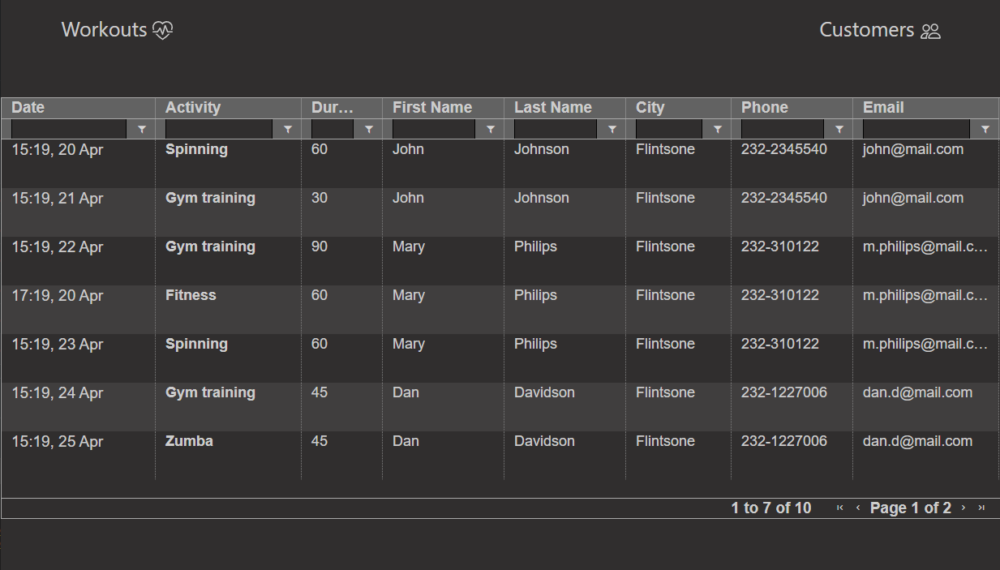
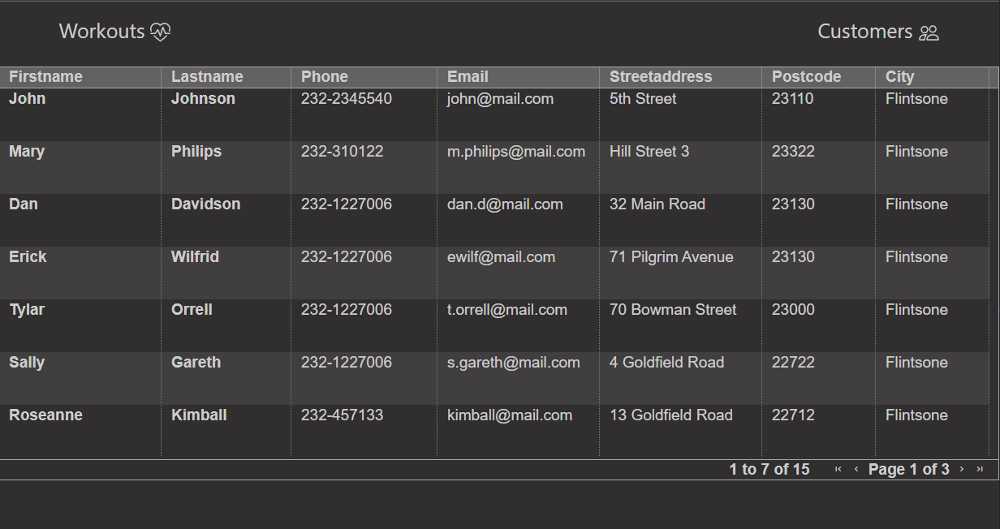
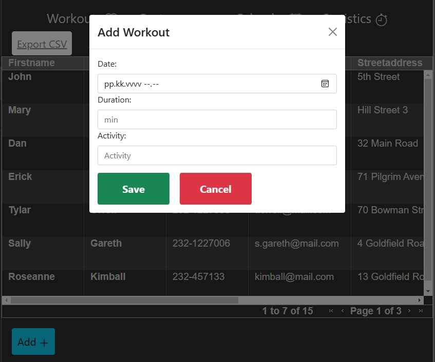
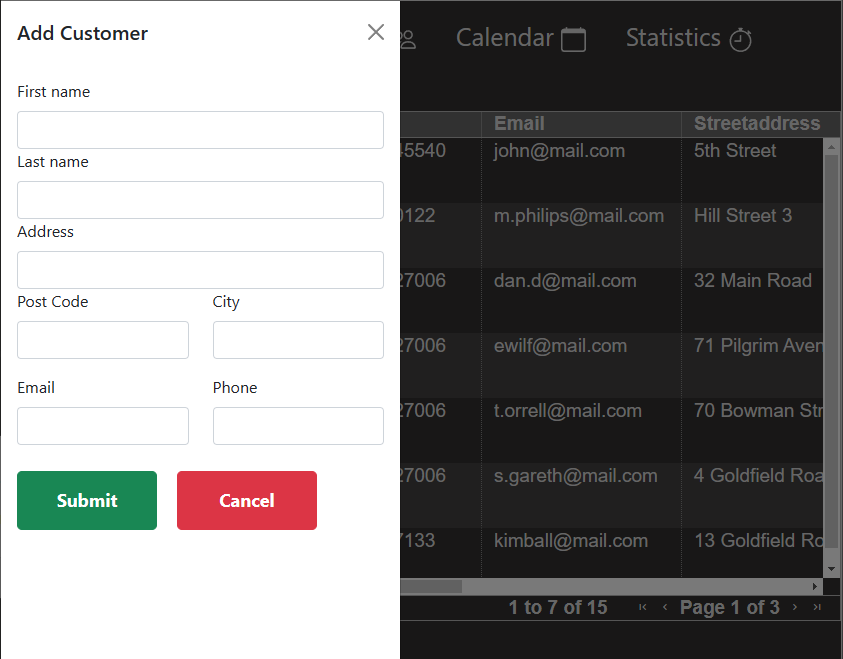
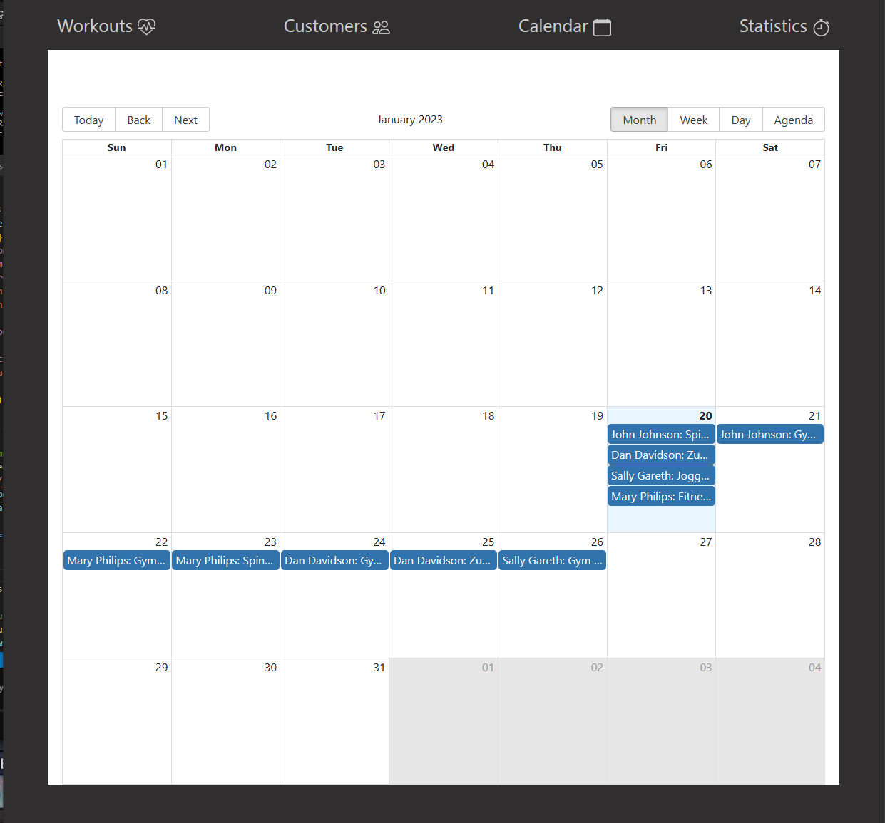
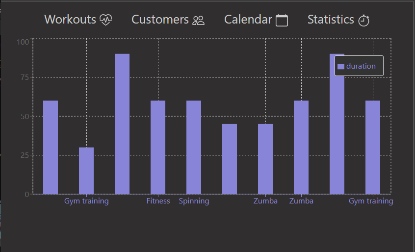

<h1>Personal Trainer</h1>

Web app for personal trainers for managing and analyzing their customer and workout data

<h2>Project specifications</h2>
This project ulitizes the following technologies:

- [AG Grid](https://www.ag-grid.com/)
- [Recharts](https://recharts.org/en-US/)
- [REST](https://restfulapi.net/)
- [Bootstrap](https://getbootstrap.com/)
- [Moment](https://momentjs.com/)

<h2>Views</h2>

Here's the main screen for all of the workouts. The workouts can be filtered, ordered and deleted from the timetable. 

Here's the customers screen showing all of the current customer data. Customer workouts can be added and modified:

and new customers can be added:

The calendar shows all of the workouts:

The statistics show the popularity of current workouts:

Thanks for checking out my project!

